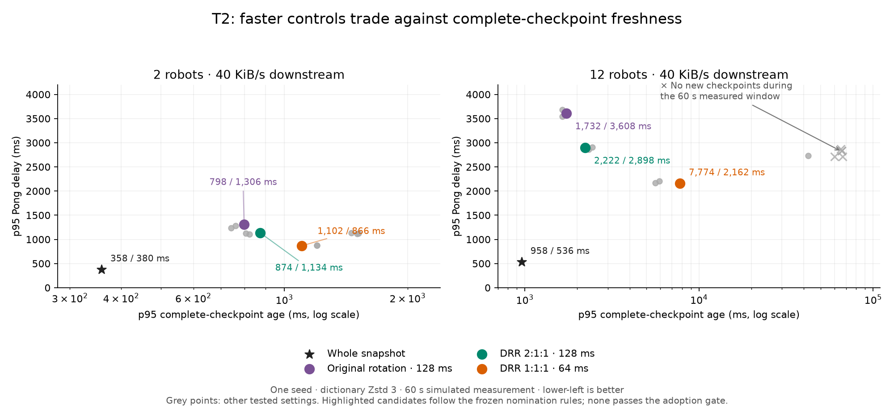
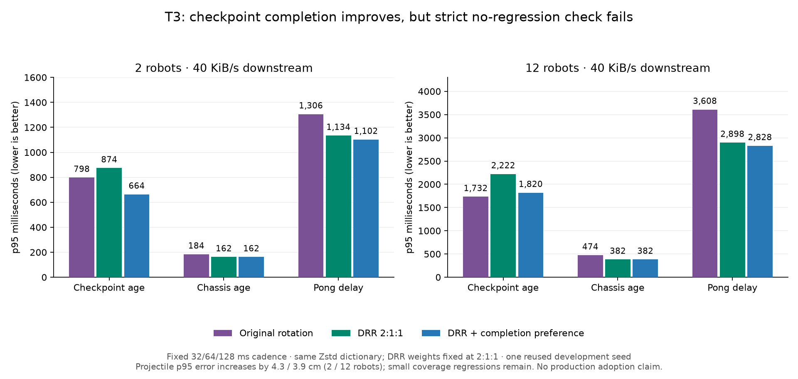
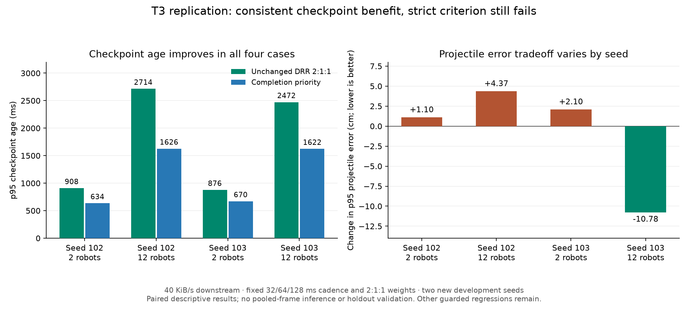

<!-- SPDX-License-Identifier: MIT OR Apache-2.0 -->
<!-- Copyright (c) 2026 hxyulin <hxyulin@proton.me> -->
# Section topics: controlled rate and scheduling experiments

Status: T1 instrumentation, T2 screening, the focused T3 ablation and its
two-seed development replication are complete;
T4 validation has not run. T1
results and measurement definitions appear below. This extends
[Stage 3](02-section-topics.md#stage-3-independent-presentation-and-checkpoint-cadences).
Stop after each stage below and report its results before continuing.

## Question and evidence

Can joint rate and scheduling changes reduce bandwidth **without transferring the
cost into checkpoint delay, pose error, missing entities or reliable-message delay**?
Keep the original adoption gate; a useful tradeoff is not automatically a pass.

The completed 72-cell Stage-3 screen varied three periods, but selected a winner
using clean-link bytes alone. Its 32/64/128 ms setting saved about 37% / 41% for
2 / 12 robots while increasing clean p95 checkpoint age by 90 ms. This is evidence
of a tradeoff, not an optimized operating point. The selected long follow-up was
interrupted: `stage3/trial-output.txt` contains 21 of 50 cells and no passing
footer. The summarizer correctly rejects it. Do not pool it as a completed trial
or treat its already inspected seeds as fresh validation data.

Current scheduling rotates over fragments of up to 1000 payload bytes; it has no
configurable weights or deficit accounting. A logical checkpoint competes through
multiple queues while each presentation list has one. Equal visits therefore do
not imply equal service to logical functions. A complete checkpoint also waits
for its last required revision: improving average topic age can miss that bottleneck.

## Model before search

For each stream i, first measure encoded bytes per publication B_i and period T_i.
The diagnostic offered load is sum(B_i / T_i), plus manifests, repair, feedback
and framing. B_i depends on cadence, change rate and baseline acknowledgements;
measure it for each setting instead of assuming it is constant. Compare offered
load with the shared service budget. At saturation, sent bytes alone cannot
identify the better setting: both may consume the entire budget.

Age at receipt is source age plus encoding, waiting, serialization and link delay.
For checkpoints, completion is governed by the last required dependency. This
suggests testing lower queue occupancy and useful completion, not merely faster
publication. Age-of-information research demonstrates that sending immediately
is not always freshness-optimal under its queueing assumptions; that motivates a
hypothesis here, not a theorem about this codec.
[Sun et al., Update or Wait](https://arxiv.org/abs/1601.02284).

A 128 ms periodic checkpoint cannot match a 32 ms control's clean checkpoint-age
distribution merely through priorities when there is effectively no queueing.
If that limit dominates, investigate representation/compression or checkpoint
construction cost in a separate ablation. Do not relax the age gate after seeing
results. Pose prediction may reduce visible error but does not make a checkpoint
newer, and requires a separate replay/render experiment.

## T1: instrumentation and trustworthy controls

Implement instrumentation first, with scheduling and publication behavior fixed.
Retain the production whole-envelope control, the current Stage-3 scheduler and
its 32/64/128 ms reference. Verify identical deterministic output with and without
instrumentation, apart from explicitly excluded measurement fields.

Record per logical function and per physical queue:

- Offered, suppressed, replaced, transmitted, repaired and usefully delivered
  bytes; fragments and datagram overhead. Attribute all bytes exactly once and
  reconcile the per-class totals to direction totals. Mark shared overhead by a
  fixed documented rule. Keep normal checkpoint and repair service distinct.
- Source capture, enqueue, first/last send, assembly and usable receipt times;
  time without service while backlogged, queue bytes and partial-frame lifetime.
  Track complete-checkpoint dependencies and which one completes last.
- Source age p50/p95/p99/max, missing-state duration, checkpoint completion rate,
  body/aim/projectile held-pose errors, missing and stale entity fractions with
  explicit denominators. Report matched-entity errors alongside coverage.
- Reliable confirmation and Pong latency/order under an injected control workload;
  repair completion and peak retained memory. Absence of controls in the old
  workload cannot demonstrate their scheduling safety.

Separate simulation time from injected transport time. During pauses, report
capture/receipt delay as well as simulation-state age. Measure blackout recovery
from link restoration to fresh usable state; whole-run p95 can hide a short outage.

Use a time-indexed network impairment trace shared across candidates so different
packet counts do not silently assign different time periods to bad network states.
Specify the rule for same-time packet loss and independent packet loss explicitly.
Keep the existing packet-index script as a separately labeled sensitivity test.
Store workload, impairment and execution-order seeds independently and hash the
source and impairment traces. Timing CPU or native transport requires a separate
run; deterministic samples are not CPU benchmarks.

T1 exit: exact restore and lifecycle invariants pass, byte totals reconcile, and
measurements diagnose at least a clean, saturated and blackout case. Summarize
which dependencies and queues cause delay. Stop before parameter search.

## T2: controlled screening of rates and priorities

Use byte-based weighted deficit round robin (DRR) as the first configurable
scheduler. Define logical groups: complete checkpoints (including manifest and
repair), chassis poses, projectile poses and ordered reliable controls. Schedule
checkpoint dependencies within their group. Otherwise adding more topic queues
implicitly changes their aggregate share. DRR provides a concrete byte-accounting
reference; RFC 8290 describes a byte-based DRR scheduler, although its CoDel packet
dropping policy is not proposed for these application messages.
[RFC 8290, section 4](https://www.rfc-editor.org/rfc/rfc8290.html#section-4).

Keep every group's weight positive, cap stored deficit, and allow idle groups'
unused capacity to be borrowed. Reliable controls retain FIFO confirmation-before-
Pong order; never replace them. Reserve a fixed positive control weight and record
its achieved delay under load. A positive weight guarantees neither a latency
bound under overload nor delivery during loss: test both explicitly.

The adopted first screen is smaller than the original full factorial. Before any
T2 performance run, the user reduced the budget to 96 runs while retaining the
original-scheduler controls. The original 1098-run proposal (two chassis periods,
two projectile periods, three checkpoint periods, four weights, three seeds)
remains deferred; it is not a required matrix for this screening stage.

| Factor | Adopted screen values |
|---|---|
| Chassis period | Fixed at 32 ms |
| Projectile period | Fixed at 64 ms |
| Complete-checkpoint period | 32, 64, 128 ms |
| Checkpoint : chassis : projectile weights | 1:1:1, 2:1:1, 1:2:1, 1:1:2 |
| Reliable control/baseline weight | Fixed at 1 |
| Compression | Dictionary Zstd 3, copied prepared dictionary |

This gives 12 weighted configurations plus the original fragment-rotation scheduler
at each of the three checkpoint periods and one whole-snapshot control: 16 variants
× 2 robot counts × 3 profiles = **96 runs**. MTU, token bucket, queue limits,
baseline retention, repair policy and aligned phase stay fixed. Unit-weight DRR
is not equivalent to the original scheduler, whose many checkpoint topic queues
collectively receive more visits.

Use only fresh seed ID 101, with workload `0x10000000 + 101`, impairment
`0x20000000 + 101`, and an independent deterministic order namespace. IDs 102–103
and the validation IDs remain unused. Randomize execution order within each
workload/network block. Compare paired runs; a single seed cannot support an
independent uncertainty estimate or a claim of generalization.
[NIST randomized block designs](https://www.itl.nist.gov/div898/handbook/pri/section3/pri332.htm).

Retain 10.016 s warmup and 60 s **simulated** measurement. Up to three independent
block processes may run concurrently: outcomes use an injected clock and fixed
source/impairment streams, not wall-clock performance. No compilation runs during
measurement. A three-variant 12-robot constrained-link pilot estimates wall time;
its duplicate cases must match the full screen exactly and are not additional
statistical replications. The [frozen plan](results/02-section-topics/t2/plan.json)
records factors, objectives, pairing, nomination rules and exclusions before
pilot/performance inspection.

Keep a Pareto set: a candidate is dominated if another is no worse on every
prespecified objective and strictly better on at least one. Report bandwidth,
checkpoint age, chassis/projectile age and error, coverage and control delay;
retain per-profile results instead of hiding a bad profile in an average. Reject
correctness failures regardless of performance. Select at most three candidates
for further exploration; include the reference even if it is dominated. Use
paired run-level differences; with one seed, report no confidence intervals.
Do not manufacture a single weighted score whose weights were chosen after results.

T2 exit: report the frontier, rate-by-weight interactions and bottleneck changes.
If no candidate approaches the existing gates, report that outcome. Stop.

## T3: targeted refinements and ablations

Choose refinements from T1/T2 evidence, then freeze their ranges before running:

| Observed bottleneck | Separate experimental change |
|---|---|
| Bursts from aligned deadlines | Offset pose publication phases in 16 ms increments within each period; preserve offered rate |
| Last checkpoint dependency waits | Within the checkpoint group, prioritize known missing revisions of the selected checkpoint, with aging to prevent starvation |
| Pending poses repeatedly obsolete | Change-triggered poses with minimum spacing and maximum silence; complete roster/lifecycle updates remain mandatory |
| Too many bytes even without queueing | Compact representation or delta pose lists, tested separately with baseline-loss and numeric-error checks |
| Fixed weights fail across conditions | Bounded age-aware service using receiver-confirmed freshness, compared against fixed DRR |

Do not let a sender use future loss or the receiver's private state. Any receiver
freshness feedback must be delayed through the link and counted in upstream bytes.
Age-aware priority can use normalized overdue age, but first define target ages,
feedback expiry and a maximum service gap. Test permanent loss so an impossible
dependency cannot monopolize service. Avoid indefinite preemption of partly sent
large messages: record useful completions and wasted partial bytes.

Run one refinement at a time against the selected fixed policy before testing
interactions. Fit response surfaces only if residuals support them; saturation,
packet boundaries and replacement create discontinuities. For this small discrete
space, an auditable enumeration is preferable to an opaque optimizer. Bayesian
search becomes useful only if the expanded space makes enumeration impractical,
and still needs the same untouched validation set.

T3 exit: freeze at most three final candidates and all analysis/acceptance rules.
Stop before opening validation results.

## T4: independent validation and decision

Use untouched seed IDs 1001–1010, with distinct workload and impairment namespaces,
for the frozen candidates and both controls. Include all five existing link
profiles, 2 and 12 robots, plus separately reported lifecycle/control stress and
unseen movement/fire patterns. Inspect no holdout result while tuning; if a result
causes retuning, it becomes development data and a new holdout is required.

The independent unit is a workload/network seed block, not a frame, robot, packet
or repeated execution of the same deterministic seed. Report each run, paired
candidate-minus-control differences and 95% bootstrap intervals resampling whole
seed blocks (preserve their profile grouping). Ten blocks give limited tail
precision: intervals describe this workload distribution, not all gameplay.
Report p99 and blackout/lifecycle maxima without claiming rare-event guarantees.
If statistically declaring a winner among multiple finalists, freeze a multiple-
comparison adjustment before validation. Do not repeatedly add seeds until a
preferred candidate passes; an inconclusive fixed-size result stays inconclusive.

The original 50% downstream saving and no p95 age/correction regression gate remains
unchanged. Zero observed correctness failures is required but is not a proof of
zero failure probability. Headless pose error cannot establish prediction replay
or perceptual quality. A promising offline candidate must subsequently pass real
app replay, rendered lifecycle/HP reconciliation, native transport/input traffic
and aggregate multi-peer trials before production adoption.

Publish configuration IDs, source/build hashes, complete raw records, failure
records, analysis code and a reproducible manifest of the frozen search and seed
partitions. Distinguish improvements over Stage 3 from meeting the production gate.
The decision may be adopt, reject or revise; stopping with no feasible candidate
is a valid scientific result.

## T1 implementation and measurement contract

Instrumentation is compiled only under `cfg(test)` in the existing experimental
codec. It observes offers, duplicate suppression, unsent replacement, individual
fragment service, reassembly/discards, decoded revisions and checkpoint promotion.
It does not alter rates, priority, frame contents, queue limits or feedback.
The diagnostic fixture repeats every full case with observation disabled and
enabled and asserts exact equality of all ordinary results, including hashes of
packet bytes/reliability/send time and decoded messages/receipt time. Detailed
observer records are the only excluded field.

The fixed reference is chassis/projectiles/checkpoints 32/64/128 ms. T1 runs six
cells: 2/12 robots × clean/limited/blackout, development workload seed 71, transport
seed `71 ^ 0x7000`, 10.016 s warm-up and 60 s measurement. Each measured workload
launches 1250 shots. Both codecs consume the same hashed source per robot count.
This is a diagnostic set, not repeated independent evidence for an optimum.

The new link precomputes separate upstream/downstream 2 ms bins. Clean has no
impairment; limited has 40–60 ms one-way delay and approximately 1% dropped bins;
blackout has 20 ms one-way delay and a 500 ms outage starting 20 s after warm-up.
Every unreliable packet sent within a dropped bin is lost. There is deliberately
no independent per-packet loss in these T1 cases. This is correlated time-bin
loss, not a relabeling of Stage 3's packet-index loss; results cannot be substituted
for the older matrix. Reliable packets use an ordered abstract recovery delay of
100 ms (after blackout end for outage traffic). Carrier retransmission bytes and
native congestion behavior are not simulated. Rates remain 512 KiB/s downstream,
or 40 KiB/s in limited, and 10 KiB/s upstream. Shared bin hashes are verified across
robot counts and both codec legs; packet counts do not advance the impairment RNG.

Confirmation snapshots followed by Pongs are injected 1008 ms after warm-up and
every 4992 ms thereafter, plus one 16 ms into the blackout interval (the same
schedule is used in all profiles). These captures are off the production 32 ms
periodic boundary, so confirmations are identified without confusing periodic
frames. Both paths retain complete independent confirmations: production uses its
existing compact player representation, the experimental path uses its existing
full JSON representation. Assertions compare each against its exact independently
decoded reference and require confirmation assembly before Pong. Production
intentionally suppresses stale snapshots after decoding, including confirmations
when a newer periodic snapshot already arrived. A passive reliable-frame mirror
therefore measures assembly before this filter; application confirmation counts
are recorded separately. The mirror uses the actual RMG1 framing and player
decoder, emits no feedback and cannot change traffic. This representation
asymmetry is part of the current controls, not evidence about scheduling alone.
No player input or actual host-worker round trip is claimed.

Interpret the records as follows:

- Main byte, age, held-error and coverage results cover the 60 s measurement
  window. Queue/transfer/dependency diagnostics and upstream lifetime totals cover
  the entire connection, including warm-up. They are labeled separately. There
  is no end drain: incomplete transfers and pending controls are explicitly
  counted instead of disappearing from successful-delivery latency distributions.
- Every transmitted fragment's payload and 19-byte header belongs to exactly one
  physical queue and logical group. The shared four-byte datagram header is a
  separate bucket. These sum exactly to sender application bytes. Queue ledgers
  also reconcile offered minus duplicate-suppressed and replaced bytes to fully
  sent plus still queued payload. Exact-revision suppression before encoding is
  counted by the existing sender counter; hypothetical encoded bytes for those
  unmaterialized frames are not invented.
- Fresh-pose bytes are assembled pose payloads that advance the presentation
  capture. Innovative-section bytes are assembled frame payloads that introduce
  a previously unseen epoch/topic/revision into the decoder. They are not claimed
  to be bytes used by prediction, and assembly alone is not useful presentation.
  Complete usable checkpoints are counted independently. Raw transfer timestamps
  support further analysis of losses, partial sends and censoring.
- Queue delay is enqueue-to-first-send, with enqueue-to-last-send reported too.
  Capture-to-encode delay exposes checkpoint backpressure before bytes enter a
  queue. Receiver assembly time and enqueue-to-assembly expose fragmentation/link
  effects. The checkpoint record includes source capture, simulation time,
  encoding, first manifest receipt and usable receipt. The completion-trigger
  class is the frame that unlocked the checkpoint, which may be a manifest or a
  reliable baseline, not necessarily the topic with the greatest mean age.
- Missing-dependency time sums waiting across retained checkpoint manifests.
  It is workload exposure, not a count of independent samples. Service-gap maxima
  include continuing backlog, sampled on the 2 ms fixture clock. Per-class queue
  peaks observe offers immediately; partial-memory peaks sample after delivery.
- Freshness ages use the injected source-capture clock. Simulation-state age is
  recorded separately against the latest 16 ms source capture, so a paused world
  cannot disguise old transport captures. A pause-specific equivalence test
  verifies that simulation-state age can be zero while capture age remains
  positive. Blackout recovery requires a usable capture generated at or after
  link restoration, separately for checkpoint, chassis and projectiles.
- Missing robots/projectiles divide by authoritative entity samples; stale
  projectiles divide by shown projectile samples. The records retain numerator
  and denominator and matched-entity error distributions, so poorer coverage
  cannot silently improve the error statistic. These are held-pose measurements,
  not prediction replay or rendered quality.

Reproduce from the checkout root after building the feature test binary:

```sh
cargo test --locked -p rm-simulator-server --features section-topics --lib --no-run
# Use the executable path printed by Cargo, which includes a build-specific hash.
python3 docs/experiments/results/02-section-topics/t1/run.py PATH_TO_TEST_BINARY NEW_OUTPUT_DIRECTORY zstd-dict
python3 docs/experiments/results/02-section-topics/t1/summarize.py NEW_OUTPUT_DIRECTORY
```

The output directory must not exist: the runner refuses to overwrite historical
measurements. Select `deflate`, `zstd`, or `zstd-dict` as the final argument; effort
is fixed at DEFLATE 1 / Zstd 3. With no argument, the summarizer validates the
original `t1/` records.

The runner records codec settings, dictionary, binary, Rust/compiler, workspace Rust-source and Cargo hashes,
checks they stay fixed throughout the run, and stores each exact JSON case as a
compressed artifact. The console transcript retains the passing test footer and
artifact names. The summarizer verifies the complete matrix, trace hashes, byte
ledgers, resource bounds, control completion/order and source/impairment pairing
before producing compact `runs.jsonl`. All six off/on repetitions must pass before
metadata marks the run complete. A failed or interrupted run remains incomplete.

The initial long run stopped on an observer assertion that equated application
confirmation delivery with reliable assembly. Investigation found the production
stale-snapshot filter's documented behavior and its existing regression test in
`udp_codec.rs`. The observer was corrected as described above; production code
was not changed. The initial failure transcript and source metadata are retained
under `t1/failures/`; those incomplete records are not included in the final
matrix. This is an instrumentation correction, not a transport fix.

## T1 results and stop decision

These are the original pre-Zstd DEFLATE measurements. They remain immutable
historical records; the post-rebase reruns are reported separately below.

All six cases completed and passed full-run instrumentation-off/on equality.
Each cell below is one seed and one 60 s measurement, with the same source and
exogenous impairment schedule on both codec legs. Values are descriptive;
there are no confidence intervals or claims of generalization from this set.
Negative downstream change means fewer bytes. At the constrained budget both
paths saturate, so changes of less than 0.05% are not meaningful savings.

| Robots | Link | Downstream change | p95 checkpoint age, whole → sections ms | p95 chassis age, whole → sections ms | p95 Pong latency, whole → sections ms |
|---|---|---:|---:|---:|---:|
| 2 | Clean | -35.26% | 30 → 120 | 30 → 30 | 0 → 0 |
| 2 | Limited | -0.05% | 500 → 970 | 500 → 202 | 426 → 2706 |
| 2 | Blackout | -35.66% | 50 → 142 | 50 → 50 | 604 → 604 |
| 12 | Clean | -39.69% | 30 → 120 | 30 → 30 | 0 → 28 |
| 12 | Limited | -0.04% | 13646 → 2126 | 13646 → 502 | 684 → 4770 |
| 12 | Blackout | -40.30% | 50 → 142 | 50 → 50 | 604 → 604 |

Zero latency means delivery in the same injected-clock iteration, not zero CPU
cost. All 13 confirmation/Pong pairs per path per cell assembled in order, with
none pending at the end. Production application filtering suppressed 8 of the
13 assembled confirmations in the two-robot limited case; the observer records
those separately, rather than classifying them as packet loss.

Fresh poses also do not imply uniformly lower error:

| Robots | Link | p95 held projectile error, whole → sections m | Missing projectile samples, whole → sections |
|---|---|---:|---:|
| 2 | Clean | 0.338 → 0.899 | 0.52% → 1.04% |
| 2 | Limited | 7.075 → 10.803 | 9.43% → 15.72% |
| 12 | Clean | 0.341 → 0.905 | 0.52% → 1.04% |
| 12 | Limited | 31.015 → 11.868 | 83.34% → 17.27% |

These errors use matched entities only; the adjacent missing fractions use all
truth-projectile samples. In the limited cases, p95 held body error improves
0.410 → 0.189 m for two robots and 5.141 → 0.457 m for twelve. The very stale
production twelve-robot result is specific to this saturated synthetic workload
and time-bin loss trace, not a claim about typical gameplay.

The lifetime diagnostic records identify three mechanisms:

1. **The last checkpoint dependency depends on workload.** In the clean two-robot
   case, normal projectiles complete 540/548 checkpoints; in the clean twelve-
   robot case, normal chassis completes all 548. Under limited service, normal or
   repaired projectiles complete 169/186 two-robot checkpoints, while normal or
   repaired chassis completes all 75 twelve-robot checkpoints. A permanently
   fixed preference for one topic is therefore a hypothesis to test, not an
   established best policy.
2. **Reliable service is a distinct bottleneck.** The ordered control/baseline
   queue's p95 enqueue-to-first-send wait is 1830 ms for two robots and 2936 ms
   for twelve under congestion. Individual maximum backlogged service gaps are
   only 198/220 ms: being served occasionally does not prevent a long FIFO wait.
   Byte-weighted service and an explicit logical control share should be tested
   in T2. Confirmation representation remains a confound when comparing against
   production, so scheduler ablations must keep the experimental encoding fixed.
3. **Repair consumes substantial capacity.** Physical repair classes account for
   31.5% / 26.7% of lifetime downstream application bytes in the limited 2/12 robot
   cases. Twelve-robot repair-chassis p95 enqueue wait is 908 ms. Checkpoint
   backpressure adds p95 source-capture-to-encode delays of 120/124 ms before
   normal queue delay even begins. Repair service and useful checkpoint completion
   need to be considered together; increasing publication alone adds offered work.

After the blackout ends, both robot counts receive fresh chassis/projectile poses
in 32 ms. Fresh complete checkpoints take 32 ms on production and 96 ms on the
experimental path. Whole-run p95 would obscure this recovery distinction.

**T1 stop decision:** instrumentation is ready for controlled screening. Do not
adopt the current setting: clean savings remain below 50%, clean checkpoints are
90 ms older at p95, and the two-robot constrained case worsens checkpoint age,
projectile error/coverage and control delay. Preserve the T2 crossed rate/weight
experiment and both controls; prioritize testing logical control service and the
checkpoint dependency bottleneck. No T2 configuration has been implemented or run.
The existing scheduler and live networking remain unchanged.

Validation: 225 library tests, one binary test and 34 doctests passed (260 total;
three long experiments ignored by the normal suite), followed by the isolated T1
experiment. Clippy with warnings denied, formatting, crate-boundary checks and
changed-file hooks passed. Full workspace `just verify` was not run; no PR was
opened. Existing exact restore, loss, lifecycle and confirmation-order tests remain
in the passing suite. T1 does not establish native carrier, prediction replay,
rendered lifecycle/HP reconciliation or multi-peer production gates.

Records: [metadata](results/02-section-topics/t1/metadata.json),
[compact rows](results/02-section-topics/t1/runs.jsonl),
[passing transcript](results/02-section-topics/t1/trial-output.txt),
[runner](results/02-section-topics/t1/run.py), and
[analysis](results/02-section-topics/t1/summarize.py). The six `*.json.gz` files in
the same directory retain complete per-transfer and checkpoint events. SHA-256
values in metadata bind each raw case; summaries can be regenerated from them.


## T1 after the Zstd rebase

The experiment now uses the shared compression selection for section values,
normal/repair manifests, pose lists, reliable controls and feedback, as well as
the whole-snapshot control. The diagnostic reliable-frame mirror and example
also decode either format with the existing decompressed byte caps. This changes
compression plumbing only: cadence remains 32/64/128 ms, scheduling remains the
original fragment rotation, and the live default remains DEFLATE.

The reruns use the same development source and impairment seeds as the original
T1, not new holdout observations. Both legs select the same codec and effort:
DEFLATE 1 for the regression rerun, dictionary-assisted Zstd 3 for the Zstd run.
The existing embedded checkpoint dictionary is fixed and hashed; it was not
retrained on these results. This is a conditional comparison using that dictionary,
not evidence of generalization to unseen workloads or a codec/level optimization.

An initial Zstd run failed byte parity in the first clean case: decoded-message
hashes and section bytes matched, but whole-snapshot bytes differed between
replays. Starting each replay with fresh thread-local compressor/decompressor
contexts removes state carried over from earlier replays. This reset is compiled
only for tests with `section-topics`; contexts are still reused throughout each
replay, including warmup. The full off/on equality requirement is unchanged.
The failed transcript and source hashes remain in
[`t1-zstd-dict-initial-failure`](results/02-section-topics/t1-zstd-dict-initial-failure/).

All six Zstd cells passed instrumentation-off/on equality. Each value below is
one development seed, 10.016 s warmup and 60 s measurement; percentages compare
Section Topics against the **Zstd whole-snapshot** control in the same cell.

| Robots | Link | Downstream change | p95 checkpoint age, whole → sections (ms) | p95 chassis age, whole → sections (ms) | p95 Pong, whole → sections (ms) |
|---|---|---:|---:|---:|---:|
| 2 | Clean | −31.17% | 30 → 120 | 30 → 30 | 0 → 0 |
| 2 | Limited | −0.02% | 334 → 766 | 334 → 182 | 312 → 1398 |
| 2 | Blackout | −31.52% | 50 → 142 | 50 → 50 | 604 → 604 |
| 12 | Clean | −36.97% | 30 → 120 | 30 → 30 | 0 → 8 |
| 12 | Limited | +0.02% | 928 → 1714 | 928 → 468 | 536 → 3678 |
| 12 | Blackout | −37.60% | 50 → 142 | 50 → 50 | 604 → 604 |

The constrained links still saturate, so the ±0.02% byte differences are not
meaningful savings. Zstd changes the baseline materially: the 12-robot whole
control's p95 checkpoint age is 928 ms, versus 13,646 ms in historical DEFLATE
T1. Section Topics now has worse checkpoint age in that cell, even though chassis
age remains better. Comparing a new candidate only against the old DEFLATE
baseline would give a misleading conclusion.

Held-projectile accuracy must still be read with coverage:

| Robots | Link | p95 matched projectile error, whole → sections (m) | Missing truth projectile samples, whole → sections |
|---|---|---:|---:|
| 2 | Clean | 0.338 → 0.899 | 0.52% → 1.04% |
| 2 | Limited | 5.239 → 8.008 | 7.60% → 11.19% |
| 12 | Clean | 0.341 → 0.905 | 0.52% → 1.04% |
| 12 | Limited | 12.646 → 9.896 | 16.20% → 13.81% |

Checkpoint completion remains workload-dependent: projectiles trigger 539/548
clean completions with 2 robots, while chassis triggers all 548 with 12 robots.
Under congestion, normal/repair projectiles trigger 230/247 completions with
2 robots; normal/repair chassis triggers all 94 with 12. These counts include
warmup. Repair payload and fragment headers consume 23.3% / 27.8% of lifetime
downstream for constrained 2 / 12 robots. Ordered control/baseline p95 queue wait
is still 1156 / 2326 ms. All 13 confirmation/Pong pairs per leg per cell complete
in order. Blackout recovery is unchanged: checkpoint/chassis/projectile fresh
capture recovery takes 32/32/32 ms for whole snapshots and 96/32/32 ms for sections.

T1's instrumentation exit is satisfied; the original adoption gate still fails.
Clean 2-robot savings remain below 50%, checkpoint age increases, and projectile
coverage/error and reliable-control delay still impose tradeoffs. The next stage
remains T2's joint cadence and logical byte-weight search, with both controls
using the same fixed codec. No rates or priorities have been tuned here.

Zstd records: [metadata](results/02-section-topics/t1-zstd-dict/metadata.json),
[compact rows](results/02-section-topics/t1-zstd-dict/runs.jsonl), and
[passing transcript](results/02-section-topics/t1-zstd-dict/trial-output.txt).
The six compressed raw cases retain detailed events as before.

The six rebased DEFLATE raw rows **exactly match** the original T1 rows after
removing only the new codec label, including packet/message hashes and every
instrumentation field. The DEFLATE rerun and Zstd run share identical source,
binary, dictionary, capture and impairment hashes. On clean links Zstd reduces
whole-snapshot bytes by 18.74% / 16.11% for 2 / 12 robots, and Section Topics
bytes by 13.60% / 12.32%, relative to the respective DEFLATE paths. Thus absolute
traffic improves on both paths, while Section Topics' relative clean-link
advantage shrinks. These paired descriptive differences do not establish an
optimal compression choice or independent validation.

Regression records: [metadata](results/02-section-topics/t1-deflate-rebased/metadata.json),
[compact rows](results/02-section-topics/t1-deflate-rebased/runs.jsonl), and
[passing transcript](results/02-section-topics/t1-deflate-rebased/trial-output.txt).
Run `python3 docs/experiments/results/02-section-topics/t1/compare_codecs.py`
to verify exact historical DEFLATE equality and regenerate the codec comparison.

Validation after integration: the server suite passes with DEFLATE and dictionary
Zstd (234 library tests, one binary test and 37 doctests per mode, 272 total per
mode). Both complete T1 matrices pass all six off/on comparisons (24 full
replays across the two codecs). Clippy with warnings denied, formatting,
crate-boundary checks and changed-file hooks pass. Historical records remain
unchanged. T2 has not started; no live codec default, rate or priority changed.

## T2 implementation and reproducibility

The offline `Sender::with_weights(bytes_per_s, [checkpoint, chassis, projectiles,
controls])` constructor enables logical-group DRR; `Sender::new` retains the
original fragment rotation. Weights must be positive and at most 16. A visit adds
1023 application-byte credits per weight; stored credit is capped at 32 quanta.
Empty groups discard credit and others borrow unused capacity. Each fragment's
payload and 19-byte header are charged to its group; the first fragment also pays
the shared four-byte datagram header. Credit does not accumulate just because a
caller polls while pacing tokens are unavailable. Checkpoint children (normal,
manifest and repair) rotate within one group. Reliable controls and baseline
frames remain in the same non-replaceable FIFO. The experiment changes neither
repair policy nor the exact complete-checkpoint promotion requirement.

The harness runs each variant's codec independently, starting with fresh reusable
compression contexts. It reuses captured source states within each block and
records their hashes, the exogenous impairment schedule hash, randomized execution
ordinal, wire/message hashes, byte ledgers, control completion and held-pose
errors/coverage. Its `rtt` profile has the same time-bin jitter/loss as `limited`,
but a 512 KiB/s rather than 40 KiB/s downstream budget. Independent processes
share no runtime codec state; their wall time is operational timing only.

Pre-screen parity checks exposed dictionary Zstd output differences for identical
input bytes: one 21,783-byte input compressed to 4664 versus 4657 bytes before any
scheduler-dependent divergence. An upstream [Zstd dictionary adjacency report](https://github.com/facebook/zstd/issues/4738)
describes a related case where the prefix determinism flag is insufficient. That
flag also failed our parity tests. The `section-topics` feature now prepares an
explicitly copied dictionary, cached immutably per compression level, instead of
letting each compressor lazily prepare a local dictionary. Replays and both codec
legs use this same construction; dictionary content and level remain fixed. The
passing tests establish reproducibility for these cases, not a general proof
about Zstd. Builds without the experiment feature keep their existing constructor.
The [pre-screen failure transcript](results/02-section-topics/t2/failures/pre-screen-compression-parity.txt)
is retained. These tests consumed development fixtures, not validation seed IDs.
Historical T1 measurements remain unchanged and are not pooled with T2.

Reproduce after building and validating, using the test executable printed by Cargo:

```sh
cargo test --locked -p rm-simulator-server --features section-topics --lib --no-run
python3 docs/experiments/results/02-section-topics/t2/run.py PATH_TO_TEST_BINARY NEW_OUTPUT_DIRECTORY --workers 3
python3 docs/experiments/results/02-section-topics/t2/summarize.py NEW_OUTPUT_DIRECTORY
```

The output directory must be new. The runner freezes source/build/dictionary,
runner, analysis and plan hashes, records each raw case as a compressed JSON file,
and marks completion only after every block passes with all expected variants
and unchanged hashes. `--pilot --workers 1` runs three full-duration cases in a
separate directory. The actual pilot took 16.5 wall-clock seconds for all three,
including fixture generation. A successful parallel pilot replay comparison is
required before treating the screen as reproducible. Pilot duplicates do not add
independent observations.

The prespecified analysis minimizes twelve objectives jointly over all six cells
and also reports per-cell frontiers. It retains paired candidate-minus-whole
values and DRR-minus-original-rotation effects at each checkpoint period, plus
the change in that effect from 32 to 128 ms. Exact nondominance uses no fitted
weights or post-hoc tolerance. Nominations retain `rr-128`, the lowest worst-case
clean byte ratio, and the lowest worst-case constrained p95 Pong among eligible
frontier candidates, deduplicated to at most three. Ties use worst checkpoint-age
ratio then configuration ID. These are exploration roles, not declared winners.

## T2 results and stop decision

The complete screen finished **96 runs in 171.6 seconds wall time with three
workers**. All three pilot duplicates match the parallel screen byte-for-byte,
including the full diagnostic events. Source/build/plan hashes remained fixed.
All reconstructed checkpoints and confirmation/Pong ordering checks passed and
resource bounds held. However, five policies failed the screen's progress
criterion: with 12 robots on the constrained link they promoted **zero new
checkpoints during the measured 60 s**, retaining an old warmup checkpoint.
These are all three `1:1:2` policies and the 32/64 ms `1:2:1` policies. Their p95
checkpoint ages reached 60.2–66.8 seconds. Positive service weights do not ensure
that fragmented exact dependencies complete before partial expiry/repair churn.

The remaining ten experimental policies and the whole-snapshot control are all
nondominated across the twelve objectives and six cells. The complete frontier is
`drr-128-111`, `drr-128-121`, `drr-128-211`, `drr-32-111`, `drr-32-211`,
`drr-64-111`, `drr-64-211`, `rr-128`, `rr-32`, `rr-64`, and `whole`.
That broad frontier is evidence of unresolved tradeoffs, not eleven equally good
choices. In particular, merely passing the progress filter does not make a
42-second p95 checkpoint age acceptable. This one-seed screen estimates no
confidence intervals and declares no statistical winner.

The frozen nomination rule retained the reference `rr-128`, nominated
`drr-128-211` for lowest worst clean byte ratio, and `drr-64-111` for lowest worst
constrained p95 Pong. Weights below are checkpoint:chassis:projectiles; control
weight remains 1. All chassis/projectile periods remain 32/64 ms.

| Robots | Constrained-link policy | p95 checkpoint age (ms) | p95 chassis age (ms) | p95 Pong (ms) | p95 matched projectile error (m) | Missing projectile samples |
|---|---|---:|---:|---:|---:|---:|
| 2 | Whole snapshots | 358 | 358 | 380 | 5.440 | 7.78% |
| 2 | Original rotation, checkpoint 128 ms | 798 | 184 | 1306 | 8.313 | 11.75% |
| 2 | DRR 2:1:1, checkpoint 128 ms | 874 | 162 | 1134 | 6.242 | 8.81% |
| 2 | DRR 1:1:1, checkpoint 64 ms | 1102 | 138 | 866 | 5.125 | 7.18% |
| 12 | Whole snapshots | 958 | 958 | 536 | 12.410 | 16.34% |
| 12 | Original rotation, checkpoint 128 ms | 1732 | 474 | 3608 | 11.078 | 16.10% |
| 12 | DRR 2:1:1, checkpoint 128 ms | 2222 | 382 | 2898 | 7.254 | 10.30% |
| 12 | DRR 1:1:1, checkpoint 64 ms | 7774 | 306 | 2162 | 5.989 | 8.53% |



The nominated 2:1:1 policy improves pose/error/coverage and control delay relative
to original rotation, while increasing p95 checkpoint age by 76 / 490 ms for
2 / 12 robots. Unit weights shift more capacity away from checkpoint dependencies:
the 64 ms nominee improves constrained control delay further but increases the
12-robot checkpoint p95 to 7.8 seconds. Its worst p95 Pong is only 10 ms lower than
unit weights at 128 ms (2162 versus 2172 ms), so the frozen nomination is a
metric extreme, not evidence that 64 ms is robustly preferable.

Clean-link savings versus whole snapshots are 32.38% / 37.42% for the 128 ms
2:1:1 nominee and 4.21% / 10.87% for the 64 ms unit-weight nominee (2 / 12 robots).
The former differs from the original-rotation clean byte totals by only 176 / 1884
bytes over 60 seconds. Scheduling alone cannot remove the inherent checkpoint-age
cost of a slower cadence. Constrained streams exhaust essentially the same byte
budget, so their throughput totals cannot establish useful bandwidth savings.
No candidate passes the original adoption gate, including its 50% 2-player
bandwidth reduction requirement and no p95 age/correction regression. These
held-pose observations still do not evaluate prediction correction.

Rate/weight interactions are not smooth. At 12 robots, increasing checkpoint
period from 32 to 128 ms changes the original scheduler's constrained p95
checkpoint age from 1644 to 1732 ms, but changes unit-weight DRR from 5936 to
5634 ms. The difference in scheduler effect is therefore −390 ms. The intermediate
64 ms unit-weight case is worse (7774 ms), so a monotonic rate-response assumption
would mislead. With 2 robots, doubling chassis weight from 1:1:1 to 1:2:1 produces
identical constrained-link wire hashes at all three checkpoint periods: unused
weight adds no benefit in those cases. With 12 robots that same weight increase
improves chassis age while severely damaging checkpoint progress.

Dependency attribution remains useful: under 12-robot congestion, chassis triggers
all completed checkpoints for the reference and both nominees (94 / 75 / 34
completions including warmup). Repair's lifetime traffic share falls from 28.1%
to 21.9% with 2:1:1 and 13.3% with the unit-weight 64 ms nominee, but the lower
repair traffic accompanies fewer complete checkpoints. Ordered control/baseline
p95 queue waits improve from 2356 to 1958 / 1566 ms; positive control weight alone
still leaves seconds of delay. Less repair traffic is not automatically more
successful delivery.

**Stop at T2.** Keep the three nominated configurations as documented exploration
references. The next useful refinement is completion-aware checkpoint service
and bounded repair/partial-frame progress, with separate ablations; do not deploy
these weights or start a wider rate/seed search from this screen. No T3 work or
holdout validation has run. Seeds 102–103 and 1001–1010 remain untouched.

Validation: 237 library tests, one binary test and 38 doctests pass (276 total),
including byte-share/idle-credit, FIFO/pacing/bounds and repeated weighted
instrumentation-off/on tests. Clippy with warnings denied, formatting, crate
boundaries, Python syntax checks, data validators and changed-file hooks pass.
The parallel screen is verified by [metadata](results/02-section-topics/t2/screen/metadata.json),
[pilot replay validation](results/02-section-topics/t2/screen/validation.json),
[all-cell tables](results/02-section-topics/t2/screen/summary.md),
[compact records](results/02-section-topics/t2/screen/runs.jsonl.gz), and
[frontiers and paired interactions](results/02-section-topics/t2/screen/analysis.json).
The 96 individually hashed compressed raw cases retain every transfer/checkpoint
event. Regenerate the plot with
`uv run --with matplotlib==3.11.2 python docs/experiments/results/02-section-topics/t2/plot.py OUTPUT_DIRECTORY`;
the [plot metadata](results/02-section-topics/t2/screen/plot-metadata.json) records
its renderer version, script and data hashes. No full workspace `just verify`
or PR was performed, and the live networking default is unchanged.

## T3 focused completion-order ablation

T2 was committed as `a3a0d33` before this change. The user authorized one focused
ablation and an 18-run comparison, not a wider T3 parameter search. All variants
retain dictionary Zstd 3, copied prepared dictionaries, 32/64/128 ms
chassis/projectile/checkpoint cadence, and the existing repair, pacing, queue,
partial-lifetime and baseline limits. Compare original rotation, unchanged
2:1:1 logical-group DRR, and 2:1:1 DRR with completion preference. The three
policies run across 2 / 12 robots and clean / RTT-loss / constrained links.
Seed ID 101 and its T2 workload/impairment namespaces are reused development
blocks. This supplies no independent validation or new seed replication.

`Sender::with_completion_priority` changes only the ordering of checkpoint child
queues. Each queued unreliable checkpoint transfer has a local enqueue-origin
checkpoint tag; the tag is not transmitted. A focus stays selected while it has
eligible front transfers, for at most one injected second. A new focus prefers
a valid retained repair request received through the existing feedback path;
otherwise it chooses the oldest started transfer, then the oldest queued one.
After timeout, another queued checkpoint gets an opportunity if one exists.
Within the focus, finish the selected transfer, then choose a started transfer or
the smallest remaining dependency. An acknowledged completed checkpoint is not
eligible for preferential service, and an epoch change resets the focus.

Preference is bounded to 4092 application bytes (four maximum-fragment quanta)
before an ordinary checkpoint round-robin fragment. The next fragment's cost is
checked conservatively with its possible shared datagram header, so the burst
cannot exceed the cap. The outer DRR weights remain 2:1:1:1, including controls;
no priority burst bypasses that group accounting. Controls keep their original
FIFO, and pending/replacement/repair behavior is unchanged. These bounds preserve
service opportunities, not a wall-time delivery guarantee under loss/overload.

This is a scheduling hint, not complete receiver knowledge: a shared revision may
serve several checkpoints even though its queued transfer has only an origin tag.
The sender cannot know whether a transmitted dependency arrived until feedback
returns. The ablation deliberately leaves receiver pinning and partial expiry
unchanged to isolate whether ordering alone improves complete delivery.

The [frozen plan](results/02-section-topics/t3/plan.json) requires lower p95
checkpoint age in both constrained cells versus unchanged 2:1:1, with no worsening
of the prespecified chassis/projectile age, held-pose errors, coverage or Pong
metrics in any of the six cells. Byte differences are reported separately;
original adoption gates remain unchanged. There are no fitted scores, confidence
intervals, post-hoc tolerances, parameter changes or extra seed runs. Both unchanged
controls must reproduce all twelve corresponding T2 raw cases exactly, excluding
only the scope label and execution ordinal. The primary hypothesis may fail even
if part of the tradeoff improves.

Reproduce from a validated prebuilt feature test executable:

```sh
python3 docs/experiments/results/02-section-topics/t3/run.py PATH_TO_TEST_BINARY NEW_OUTPUT_DIRECTORY --workers 3
python3 docs/experiments/results/02-section-topics/t3/summarize.py NEW_OUTPUT_DIRECTORY
```

The runner and analysis record the same source/build/dictionary/plan hashes and
complete raw per-transfer evidence as T2, in a new output directory. No compilation
runs during the parallel measurement. New unit tests check retention of a started
transfer, the burst's round-robin opportunity, focus timeout/completion release,
received repair preference, FIFO controls and exact-state/instrumentation parity.

### T3 results and stop decision

All 18 runs completed in **29.1 seconds wall time with three workers**. The twelve
unchanged-control cases exactly reproduce T2 after excluding only scope and order
labels. Exact checkpoint reconstruction, monotonic promotion, memory/byte bounds
and confirmation-before-Pong checks pass. All 13 control pairs per case finish,
and every case promotes new checkpoints during measurement.

| Robots | Constrained-link policy | p95 checkpoint age (ms) | p95 chassis age (ms) | p95 Pong delay (ms) | Measured complete checkpoints |
|---|---|---:|---:|---:|---:|
| 2 | Original rotation | 798 | 184 | 1306 | 203 |
| 2 | Unchanged DRR 2:1:1 | 874 | 162 | 1134 | 181 |
| 2 | DRR 2:1:1 + completion preference | 664 | 162 | 1102 | 260 |
| 12 | Original rotation | 1732 | 474 | 3608 | 78 |
| 12 | Unchanged DRR 2:1:1 | 2222 | 382 | 2898 | 61 |
| 12 | DRR 2:1:1 + completion preference | 1820 | 382 | 2828 | 88 |



Relative to unchanged DRR, constrained p95 checkpoint age improves by 210 ms
(24.0%) with 2 robots and 402 ms (18.1%) with 12. Chassis p95 remains unchanged,
and p95 Pong improves by 32 / 70 ms. More exact checkpoints complete under the
same budget. Against original rotation, the 2-robot case improves checkpoint,
chassis and control delay; the 12-robot case still has 88 ms worse checkpoint age,
while preserving its chassis/control advantages.

The **strict primary hypothesis fails**, because small prespecified guard metrics
regress against unchanged DRR. The constrained 2-robot projectile p95 error rises
from 6.242 to 6.285 m (+4.27 cm), missing-truth coverage worsens by 0.0208 percentage
points, and stale-projectile fraction rises by 0.0284 percentage points. With
12 robots, projectile p95 error rises from 7.254 to 7.293 m (+3.93 cm), projectile
p95 age increases 432 → 448 ms, missing coverage worsens by 0.00167 percentage
points, and body p95 error increases by about 0.026 mm. These are descriptive
one-seed differences; their small size does not justify inventing a tolerance
after observing them, nor does the tiny body difference establish a practically
important regression. All clean/RTT-loss guard metrics remain unchanged.

Traffic is essentially unchanged: clean downstream changes by +12 / −1444 bytes
over 60 s for 2 / 12 robots versus unchanged DRR. The constrained links still
saturate their budgets. Repair's lifetime share falls from 19.2% to 3.0% with
2 robots and 21.9% to 10.2% with 12. However, total discarded received partial
payload rises from 32,558 to 50,636 bytes and 76,364 to 260,435 bytes, respectively.
Completion ordering changes packet timing against the fixed loss bins and how
quickly subsequent captures enter service; reduced repair traffic is not proof
that every form of waste decreased. Lifetime preference/rotation service is
1,285,308 / 327,968 bytes (2 robots) and 1,080,375 / 257,483 bytes (12 robots).
No focus timeout occurs in these six screen cells; its release behavior is
covered by the targeted unit test, not demonstrated by these workloads.

This is a promising completion improvement, **not a passing no-regression result
or production adoption**. The clean-link bandwidth/age tradeoff remains, so the
original 50% saving and no age/correction regression gate is still unmet. Stop
this ablation here. At this stop, fresh-seed replication had not run. The
subsequently authorized replication appears below; the original failure remains
unchanged. No tolerances, T4 evaluation or live integration were added.

Validation: 240 library tests, one binary test and 39 doctests passed (280 total),
plus clippy with warnings denied, formatting, crate boundaries, Python syntax,
all artifact/baseline validators and changed-file hooks. The [metadata](results/02-section-topics/t3/screen/metadata.json)
records the frozen source/build/plan, the [analysis](results/02-section-topics/t3/screen/analysis.json)
retains every guarded regression and both paired comparisons, and the
[all-cell table](results/02-section-topics/t3/screen/summary.md) and
[compact records](results/02-section-topics/t3/screen/runs.jsonl.gz) summarize the
18 hashed raw case files. Regenerate the plot with
`uv run --with matplotlib==3.11.2 python docs/experiments/results/02-section-topics/t3/plot.py OUTPUT_DIRECTORY`.
No full workspace `just verify`, PR or push was performed for this stage.

## T3 replication on development seeds 102 and 103

The fixed completion policy was compared against unchanged DRR 2:1:1 on each
of seeds 102 and 103, with 2 / 12 robots and clean / RTT-loss / constrained links:
24 runs, three workers, **48.4 seconds wall time**. Each run retains 10.016 s of
warmup and 60 s of measured injected time. The [plan](results/02-section-topics/t3-replication/plan.json)
was frozen before measurement, including the original strict acceptance rule.
Only the test harness was parameterized: seed IDs now determine both the actual
capture/impairment streams and their recorded metadata. Cadences, compression,
weights, completion ordering, repair behavior and queue bounds remain fixed.

All values below compare unchanged DRR → completion priority on constrained links.
Projectile error is the held-pose proxy, not application prediction error.

| Seed | Robots | p95 checkpoint age ms | Reduction | p95 projectile error change | p95 Pong change ms |
|---|---:|---:|---:|---:|---:|
| 102 | 2 | 908 → 634 | 30.2% | +1.10 cm | +2 |
| 102 | 12 | 2714 → 1626 | 40.1% | +4.37 cm | −122 |
| 103 | 2 | 876 → 670 | 23.5% | +2.10 cm | +4 |
| 103 | 12 | 2472 → 1622 | 34.4% | −10.78 cm | −114 |



Checkpoint improvement repeats in all four cells. Measured checkpoint promotions
increase 181 → 274 and 59 → 93 on seed 102, and 179 → 263 and 62 → 90 on seed 103.
Together with the earlier seed 101, this supports a repeatable development-workload
benefit, but three selected development seeds do not establish a holdout result.

**Both new seeds fail the unchanged strict no-regression criterion.** Seed 102
has nine guarded regressions: projectile error, missing and stale projectile
fractions at both counts, 2-robot Pong delay, and 12-robot projectile age (+16 ms)
and body error (+0.032 mm). Missing-projectile fractions rise by 0.209 / 0.157
percentage points. Seed 103 has seven regressions, all at 2 robots: chassis age
(+4 ms), body error (+0.018 mm), aim error (+0.011 rad), projectile error, missing
and stale projectile fractions, and Pong delay. Missing coverage worsens by
0.129 percentage points. Its 12-robot case has no guarded regressions. The
[analysis](results/02-section-topics/t3-replication/screen/analysis.json) retains
all exact deltas without introducing tolerances or pooling frames as replicates.
All clean and RTT-loss guard metrics remain unchanged on both seeds; their byte
counts differ slightly. Constrained budgets remain saturated.

All 24 cases pass exact reconstruction, monotonic checkpoint promotion,
confirmation-before-Pong, all 13 control completions, positive checkpoint progress,
queue/partial-memory bounds and byte conservation checks. Paired workload and
impairment hashes match; different seeds have different workload and lossy-link
traces. Clean-link impairment hashes correctly remain identical because that
profile has zero delay and loss. Frozen source, binary and raw-case hashes are in
[metadata](results/02-section-topics/t3-replication/screen/metadata.json), with an
[all-cell table](results/02-section-topics/t3-replication/screen/summary.md) and
[compact records](results/02-section-topics/t3-replication/screen/runs.jsonl.gz).

Validation: 240 library tests, one binary test and 39 doctests passed; clippy with
warnings denied, formatting, crate boundaries, Python syntax, artifact validation
and changed-file hooks passed. Matplotlib 3.11.2 was run through `uv`; regenerate
with `uv run --with matplotlib==3.11.2 python docs/experiments/results/02-section-topics/t3-replication/plot.py OUTPUT_DIRECTORY`.

Stop this stage here. Keep the candidate as an experimental checkpoint-age
improvement with measured tradeoffs. The next useful question is whether those
tradeoffs matter under application prediction, before selecting a practical
acceptance tolerance or tuning another heuristic. T4 seeds 1001–1010 remain
untouched. No commit, push, PR or full workspace `just verify` was performed
for this replication.

### Projectile-error follow-up

A [post-hoc investigation](results/02-section-topics/t3-projectile-analysis/README.md)
reconstructs all 12 constrained projectile-age distributions exactly from the
existing seed 101–103 records. It identifies lower projectile delivery throughput
at 2 robots, timing-sensitive results at 12 robots, and the distinction between
held-position error and actual application prediction. No new simulation runs,
policy changes or acceptance tolerances were introduced.

The subsequent [common-ID/common-time audit](results/02-section-topics/t3-projectile-paired/README.md)
of seed 102 at 2 robots finds a +2.64 cm mean and +1.25 cm p95 error change on
matched observations, with transient changes over 1 m in both directions. It
regenerates only truth positions and reuses the recorded network arrivals. These
held-position findings do not establish actual prediction or gameplay impact.

### Decision after projectile investigation

The user accepts the measured few-centimetre aggregate projectile-error tradeoff
and requests committing T3, its replication and diagnostics. Retain completion
priority as an explicit experimental option at the tested rates and weights.
This is a practical development decision made after inspecting the results,
not a retroactive pass of the prespecified strict no-regression hypothesis or
a change to the original production-adoption gate. The metre-scale transient
paired differences, missing coverage, and lack of application-prediction evidence
remain documented. No new numerical tolerance or default/live policy is introduced.
